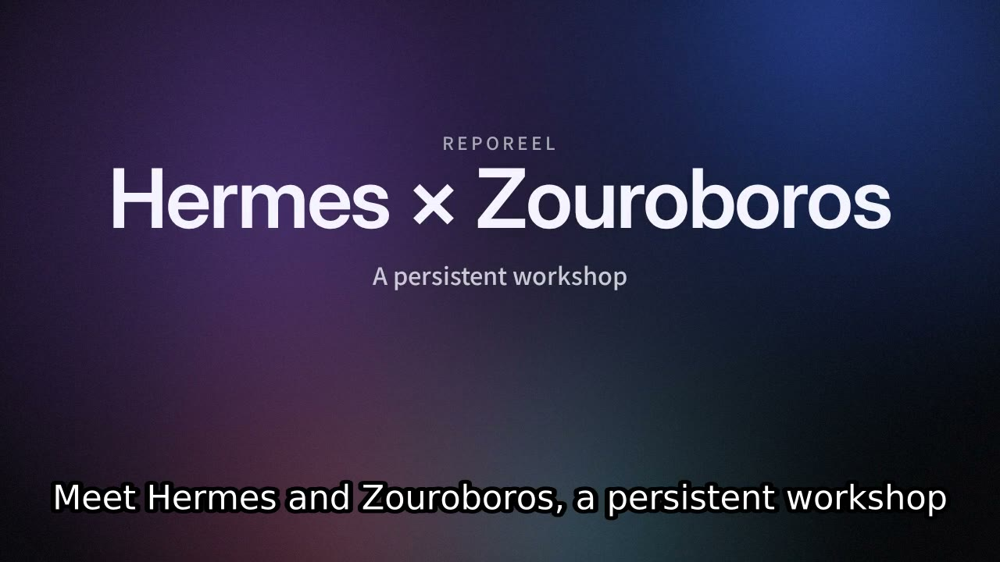

# Huashu Keynote renderer

[Watch the 27.7-second narrated Hermes × Zouroboros proof](examples/hermes-keynote.mp4)
([captions](examples/hermes-keynote.srt)). Rendered through `produce()`, with local
Kokoro narration and no script-generation API calls.



Choose **Huashu Keynote** in the Animation selector, pass `--renderer huashu-keynote`
to the CLI, or send `options.renderer: "huashu-keynote"` to `POST /api/jobs`.
The existing script review, local Kokoro narration, poster, player, MP4 and SRT
routes remain the consumers. Hyperframes stays the default.

## Setup on Linux

Use an operator-managed checkout; RepoReel does not download executable code at
request time. Tested engine revision: `26dba25b2b495c2138848c29a2c90df356a20325`.

```bash
git clone https://github.com/marlandoj/huashu-art-motion.git /path/to/huashu-art-motion
git -C /path/to/huashu-art-motion checkout 26dba25b2b495c2138848c29a2c90df356a20325
uv venv /path/to/huashu-venv
uv pip install --python /path/to/huashu-venv/bin/python playwright==1.63.0
/path/to/huashu-venv/bin/python -m playwright install chromium
export HUASHU_ROOT=/path/to/huashu-art-motion
export HUASHU_PYTHON=/path/to/huashu-venv/bin/python
bun src/server.ts
```

The host also needs ffmpeg with libx264 and libass, ffprobe, Chromium system
libraries, and RepoReel's existing Kokoro TTS setup. Keep the same browser-cache
environment for installation and the server. Install dependencies during host
provisioning, before accepting jobs. `HUASHU_ROOT` is checked before narration;
Python/browser/codec errors are surfaced as failed jobs, with no silent fallback.

```bash
bun src/cli.ts https://github.com/owner/repo --renderer huashu-keynote --captions
# Curated source-grounded proof; local TTS, no script-generation API call:
bun scripts/demo-huashu.ts /tmp/hermes-keynote landscape
```

## Contract and boundaries

- 30 fps, landscape 1280×720, vertical 720×1280, square 1080×1080.
- Each scene lasts at least 3.2 seconds (5.2 for four cards), or narration + 0.4-second lead +
  0.9-second tail, rounded up to a whole frame. Narration is never speed-adjusted.
- Titles/outros use title cues; other scenes use feature cards. Stats preserve
  their original strings. Code is presented as text cards, without highlighting.
- Keynote fixes the visual treatment and normalizes `style` to `studio` for
  scripting. Existing Hyperframes styles remain available through Hyperframes.
- Captions use RepoReel's estimated narration timing (not word-level alignment).
  The bottom 23% is reserved when enabled. `out.srt` uses the existing download route.
- Jobs retain `huashu/plan.json` and per-scene specs for diagnosis. Temporary
  encoded clips are removed after success, cancellation or failure. Final output
  is checked for video/audio streams and duration before entering job storage.
- Rendering is sequential under the existing queue and bounded to 12 minutes.
  Cancellation kills the wrapper's active process group, including Chromium and
  ffmpeg. This does not change the existing TTS cancellation behavior.
- Cache variants are separated by renderer; old Hyperframes keys stay intact.
- No live service deployment, other Huashu grammars, reference-video ingestion,
  external images, or restricted character artwork is included.

## Attribution

Huashu Art Motion by alchaincyf is loaded from the separate checkout, not vendored.
Preserve its [MIT license](https://github.com/alchaincyf/huashu-art-motion/blob/26dba25b2b495c2138848c29a2c90df356a20325/LICENSE)
and [font license notices](https://github.com/alchaincyf/huashu-art-motion/blob/26dba25b2b495c2138848c29a2c90df356a20325/scripts/engine/lib/fonts/LICENSES.md).
The engine loads its bundled fonts. This integration uses geometric Keynote
cards and RepoReel text; it does not reference the author's character art.

## Verification

```bash
bun run typecheck
bun test
python3 -m unittest discover -s tests -p 'test_*.py'
# Optional: real three-format rendering with generated test tones
bun scripts/smoke-huashu.ts
```

The curated sample script comes from the Hermes × Zouroboros README's shared
memory, local MCP, read-only intake and explicitly started worker capabilities.
See `docs/examples/hermes-script.json` and `scripts/demo-huashu.ts`.

### Captured format checks

| Format | Resolution | Frame rate | Clip duration | Render wall time |
| --- | --- | --- | --- | --- |
| landscape | 1280×720 | 30/1 | 3.3 s | 41.8 s |
| vertical | 720×1280 | 30/1 | 3.3 s | 41.7 s |
| square | 1080×1080 | 30/1 | 3.3 s | 50.8 s |

Measured in the development sandbox while other validation ran; these are
short synthetic-audio checks, not a production capacity benchmark. Canvas
capture is CPU-heavy; budget substantially more render time than reel duration.

[Landscape frame](examples/keynote-landscape.jpg) ·
[Vertical frame](examples/keynote-vertical.jpg) ·
[Square frame](examples/keynote-square.jpg).

Browser verification covered selection, saved settings, disabled style controls,
and JavaScript errors. Specialist routing ran in shadow mode (zero model calls).
For sandbox validation only, the installed Hyperframes dependency's hardcoded
home TTS cache paths were redirected to `/tmp`; that dependency change is not
shipped. Production uses the existing writable TTS cache.
