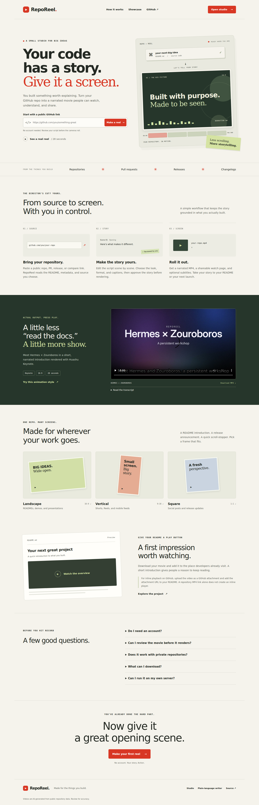

# RepoReel website

The main server now serves the product homepage at `/` and the creation studio at
`/studio`. Existing `/v/:id` watch pages and API routes retain their URLs.

The homepage includes the checked-in Hermes Keynote movie, captions, transcript,
format links, and README publishing guidance. All visuals and fonts are local;
visiting the homepage does not contact a model provider or start a job.

## Preview the site

```sh
bun install --frozen-lockfile
bun run preview
# http://127.0.0.1:3902
```

The preview binds to loopback, serves the actual homepage and studio, and supports
video playback. It does not initialize the database, background workers, rendering,
or paid providers. Creation and writer API calls return an explanatory 503.
Use `PORT=3917 bun run preview` to choose another port.

For the working pipeline, follow the main README's runtime setup and use
`bun start`. Homepage GET navigation only prefills the studio; a separate explicit
studio submission starts a job. Supported prefill parameters:

- `repo`: GitHub source text (up to 300 characters).
- `format`: `landscape`, `vertical`, or `square`.
- `renderer`: `hyperframes` or `huashu-keynote`.

Invalid format/renderer values are ignored. URL text is assigned as an input value,
never interpolated into HTML. The server retains responsibility for source URL
validation and renderer availability.

## Files and consumers

- `src/lib/site.ts`: Hono site routes, homepage and a fixed showcase asset allowlist;
  mounted by both `src/server.ts` and `src/preview.ts`.
- `public/site/site.css`: responsive homepage styling.
- `public/site/studio.css`: shared styling for the studio and existing watch/review UI.
- `public/site/hermes-keynote.vtt`: browser captions from the checked-in SRT.
- `src/lib/ui.ts`: existing studio, with prefill and accessible selection state.
- `tests/site.test.ts`: route, asset isolation, captions and video range checks.

The demo is served directly from `docs/examples` with byte-range support for
seeking. It is not copied into another media store. Decorative format illustrations
are marked as illustrations, not extra generated examples.

## Verification

- `bun run typecheck`, `bun test`, Python renderer lifecycle tests.
- Chromium checks: repo prefill without generation, format/renderer prefill,
  caption defaults, unsafe query text, preview error recovery, actual video play
  and seek, nine caption cues, keyboard skip link and FAQ interaction.
- Homepage and studio checked at 320, 375, 390, 768, 1024 and 1440 pixels.
- Desktop and mobile screenshots are included here for review.

No production deployment is included. Before public generation is enabled, resolve
and validate the existing public-launch controls work in PR #9 and configure the
intended host, domain, provider limits and rendering dependencies. This site change
neither merges that PR nor enables a provider. The agent skill remains in separate
PR #10; the website does not require it.

## Screenshots

[Desktop homepage](desktop.png) · [Mobile homepage](mobile.png) ·
[Desktop studio](studio.png) · [Mobile studio](studio-mobile.png)


